# AWS Simple Storage Service: Get Started
## An Object Storage Service storing Data Objects in buckets.  
* ### An `object` is a file and metadata describing a file.  
* ### A `bucket` is like a folder as container of objects.
* ### Offers an industry level `Scalability, Availability, Security and Performance`
* ### Can store and protect `any amount of data`

### 1) Home Page
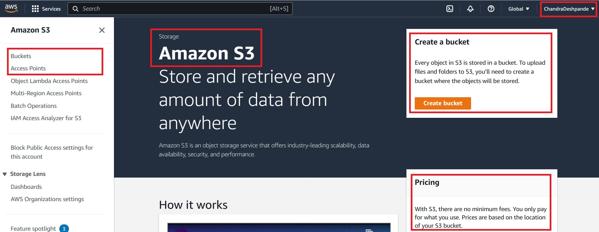

### 2) Create Bucket
* #### Bucket Name: Follow naming practices to name a bucket.
* #### Region: Asia Pacific Mumbai
* #### Copy setting for existing bucket: Default.

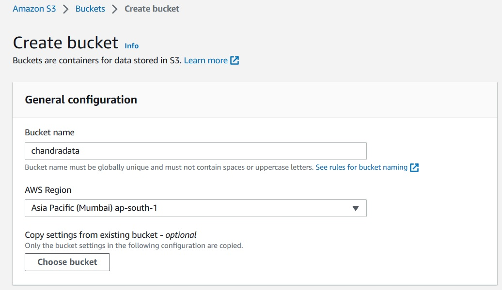

* #### Object ownership: Default.
* #### Block public access: Allow all users to access a bucket.  Uncheck all boxes here.
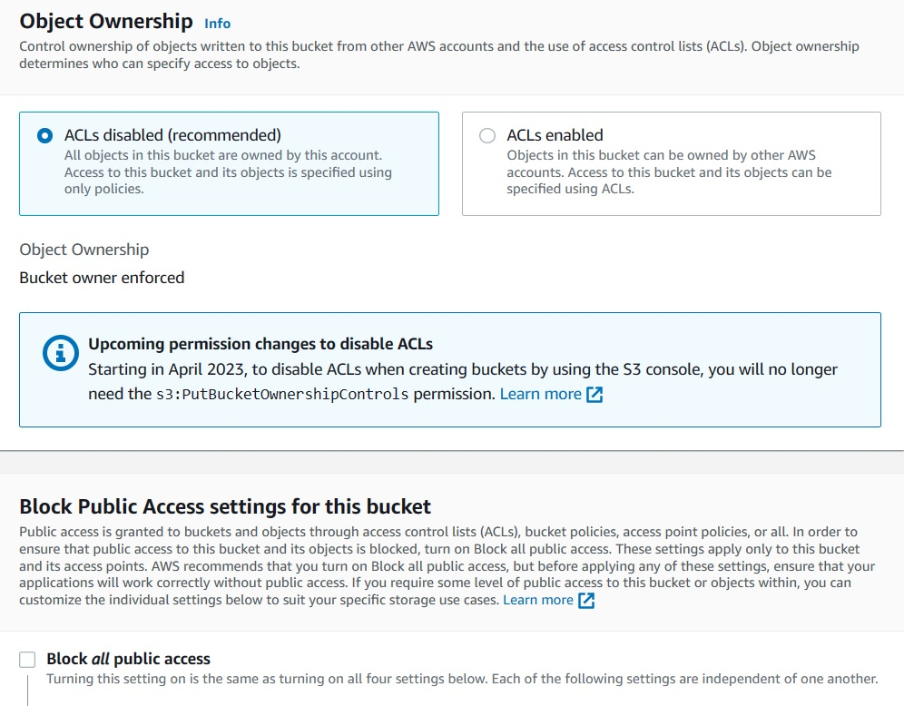

* #### Bucket Versioning: Lets disable it for a while.
* #### Tags: Lets bypass it for a while
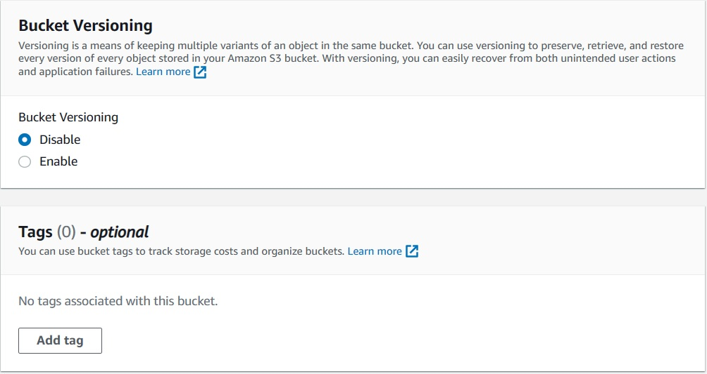

* #### Encryption: It applies server side encryption by default.  Apply Amazone S3 managed key (SSE-S3).
* #### Bucket key: Disable.
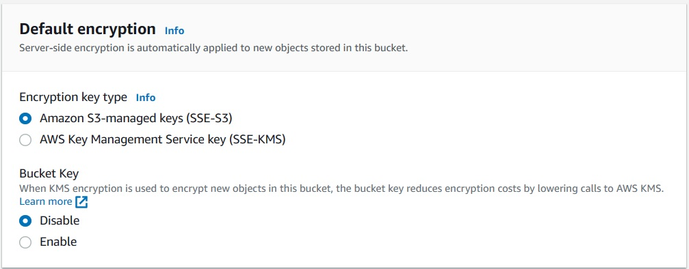

* #### Advanced Settings: It refers to configuring `Object Lock`. Lets leave it disabled.

* #### Click on 'Create Bucket'. Observe the page showing creation status.
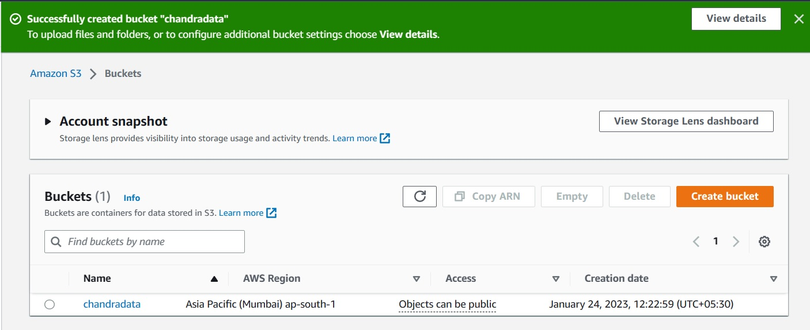

### 3) View objects in bucket.
* #### Click on bucket name. Observe the page showing bucket details.
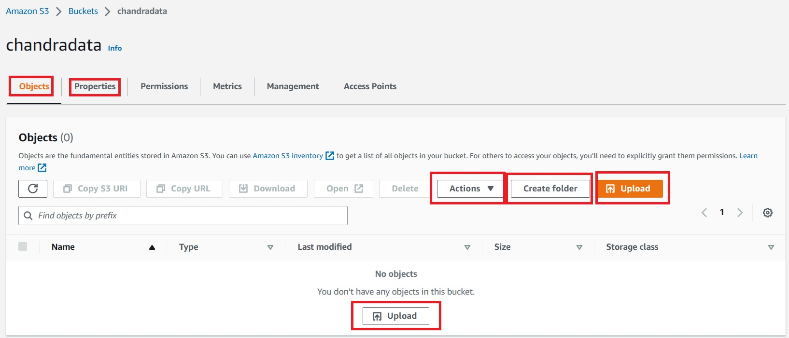

* #### Its now bucket properties and list of objects.
* #### Objects: List all objects in a bucket.
* #### Properties: View properties of bucket.
* #### Permissions, Metrix, Management: Lets visit them later.
* #### Create a folder and upload a file.

### 4) Upload files.
* #### Find the upload button.
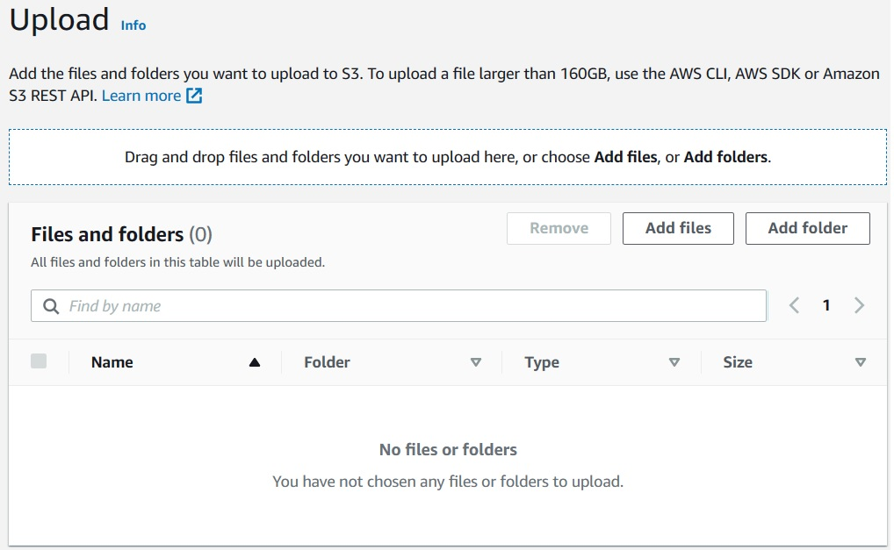

* #### Create a folder and upload a file by clicking on 'Add Files' button.
* #### Brows to the file in local machine and click on `Upload`.
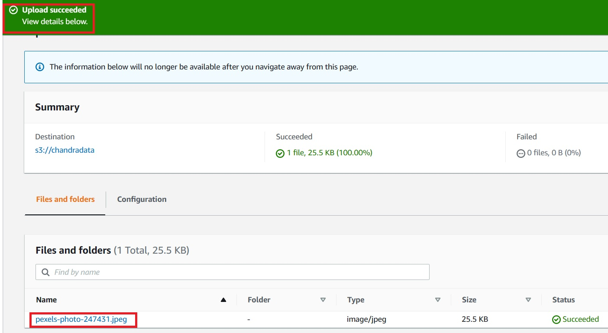

### 5) Observe object properties.
* #### Click on uploaded object name.
* #### Observe the properties like Region, URLs, Permissions etc.
* #### Copy Object URL and try to access an image in browser. Access has been denied.
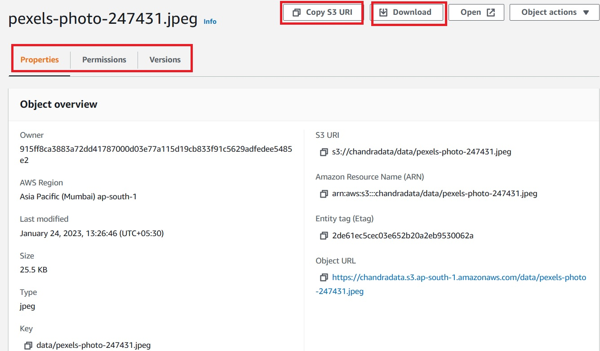

### 6) Configure the public access.
* #### Open properties for Bucket. Bucket -> Permission
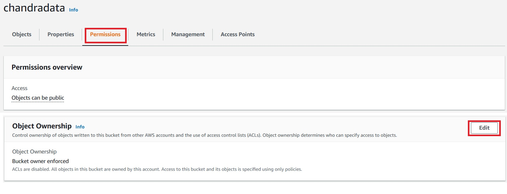
* #### Configure bucket for Object Ownership to enable ACL.
* #### Keep Object ownership as `Bucket Owner Preferred`.
* #### Save changes.
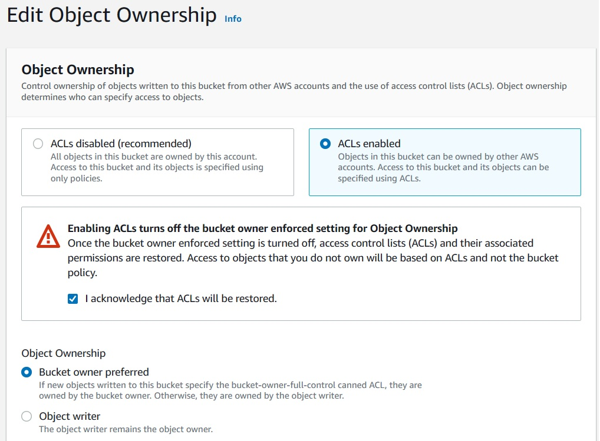

* #### Observe that, ACL Edit has been enabled.  Click on `Edit`.
* #### For `Everyone (Public Access)`, check the `List' and `Read` for Object and Bucket ACL.
* #### Save changes.
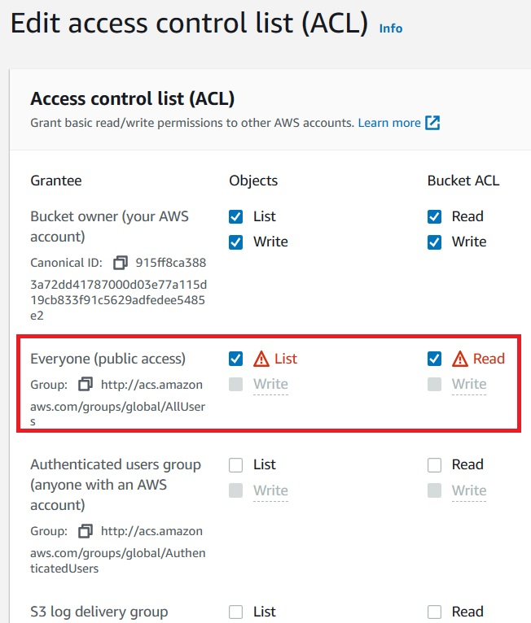
* #### Go to the properties of object and select `Permissions`. Observe, permissions have been enabled for object.  Now, object is publically accessible.
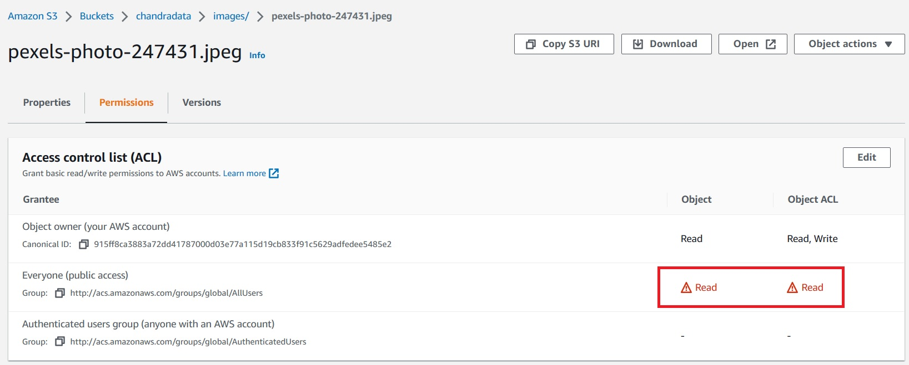

### 7) Download the object
* #### Find the button of Download.  Click it to download an object in the local machine.
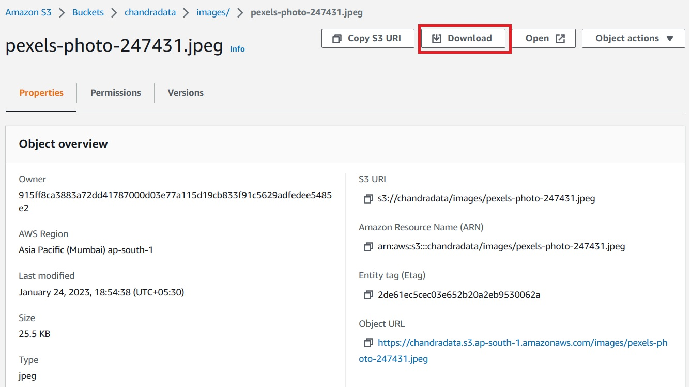
* #### Empty Bucket and Delete Permanently.
* #### Go to the list of the buckets.  Select a bucket to empty.
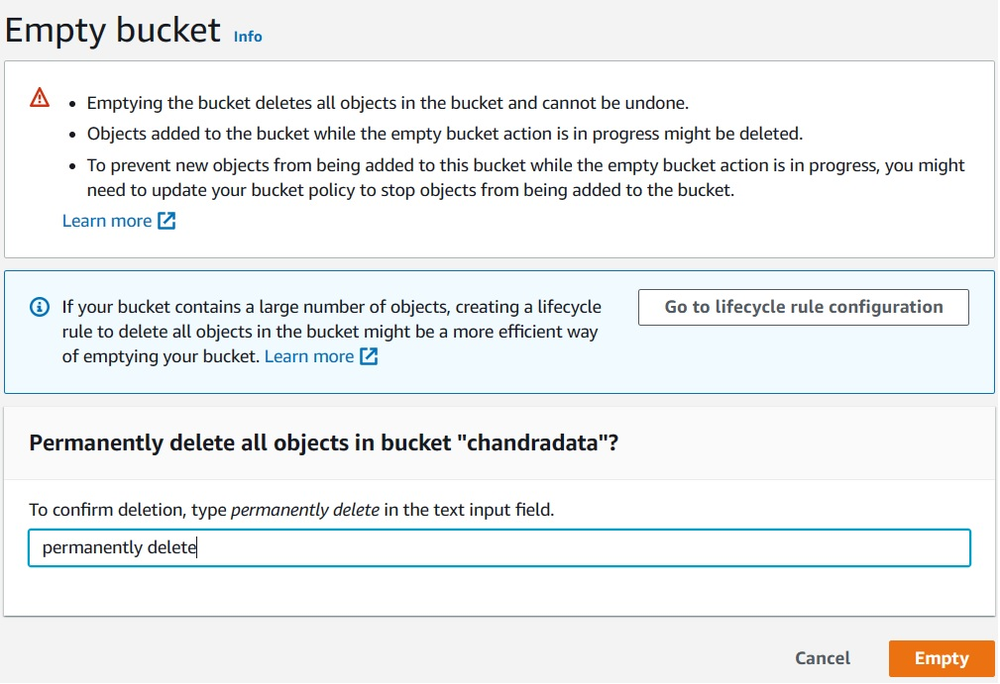
* #### Delete a bucket.
* #### Go back to the list of buckets.  Select a bucket to delete and click the `Delete` button.
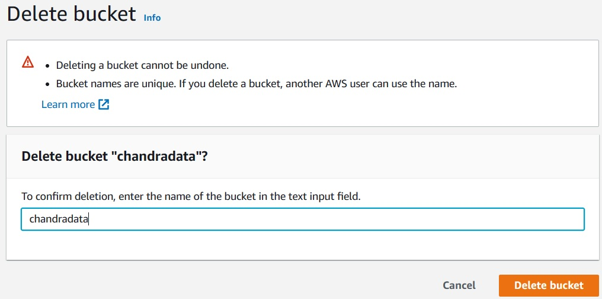

## Thats all in this lab.

