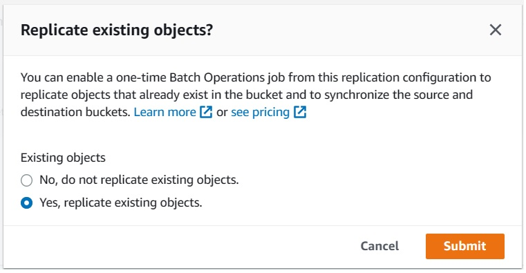

# AWS Simple Storage Service: More Operations on S3
* ### **Storage Classes**: Offers range of storage classes supporting different use cases. 
* ### **Versioning**: Keeping multiple variants of an object in the same bucket to preserve, retrieve, and restore every version.
* ### **Replication of Bucket/Object**: Replicate entire bucket or selected objects to another S3 bucket in your current account or a different account.
* ### **Object Locks**: Can help prevent objects from being deleted or overwritten for a fixed amount of time or indefinitely.
* ### **Object Life Cycle**: Can help to automate a life cycle for an Object.

### 1) Create bucket and upload object
* #### Name the bucket.
* #### Go with default object ownership of `ACLs Disabled'.
* #### Unblock all public access.
* #### Enable bucket versioning.
* #### Create a folder.
* #### Upload a file.

* #### Observe properties as 
* ##### `Versioning Enabled`, 
* ##### `Lock Disabled`, 
* ##### `Storage Class as Standard`.

### 2) Change Storage class
* #### From `Standard`, change storage class to `One Zone IA`.
* #### Observe in properties, Storage Class has been set to 'One Zone IA'.

* #### Also, you can change storage class from `Actions`.

### 3) Check automatic versioning.
* #### Upload same file.
* #### Observe the versioning

### 4) Replication of entire bucket.
* #### Delete all versions of a file from... `chandradata/images`.

* #### Create a new bucket `chandradatacopy`.
* ##### Keep same region.
* ##### Keep default object ownership
* ##### Block all public accesses
* ##### Enable bucket versioning.
* ##### Go with default encryption

* #### Go to `ChandraData` and open `Management` section.
* #### Lets create a Replication Rule.

* #### Name the replication
* #### Enable the status
* #### Observe the source bucket name as `chandradata`.
* #### Set the rule scope to `Apply to all objects in bucket`.
* #### Set destination to bucket in same account.  And set account to `chandradatacopy`.
* #### IAM Role: `Choose from existing IAM role` as `Create a new role`.
* #### Encryption: Lets go with default.  Do not check for AWS KMS.
* #### Destination Storage Class: Check the box and select for `One Zone IA`
* #### Additional Replication Option: `Replica Modification Sync.

* #### Click on `Save`.
* #### On the dialog box of `Replicate existing object?`, choose `No`.

* #### Observe the rule.

* #### Upload a file to `chandradata`.  Wait for 5-10 Min and observe in `chandradatacopy`, the file is replicated.

* #### Try uploading another version of  same file to  bucket `chandradata` and observe within 5-10 min, a version file is replicated into `chandradatacopy`.

### 5) Defining Object Locks.
* #### Create a bucket by enabling Object Lock.
* ##### Enable bucket version
* ##### Leave other settings as default except Object Lock.
* ##### Drop down Advanced Settings and enable Object Lock.
* ##### Check the acknowledgement.
* ##### Note, while creating a bucket, it does not expect from you to set Retention Period/Legal Hold.

* #### Optional but Retention Period can be changed from default.
* #### Now every object uploaded/versioned to the bucket is locked.
* #### For each object, now you can configure Retention Period and/or Legal hold.

