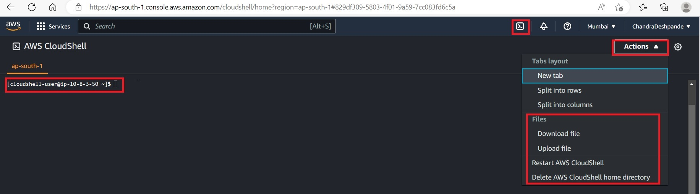
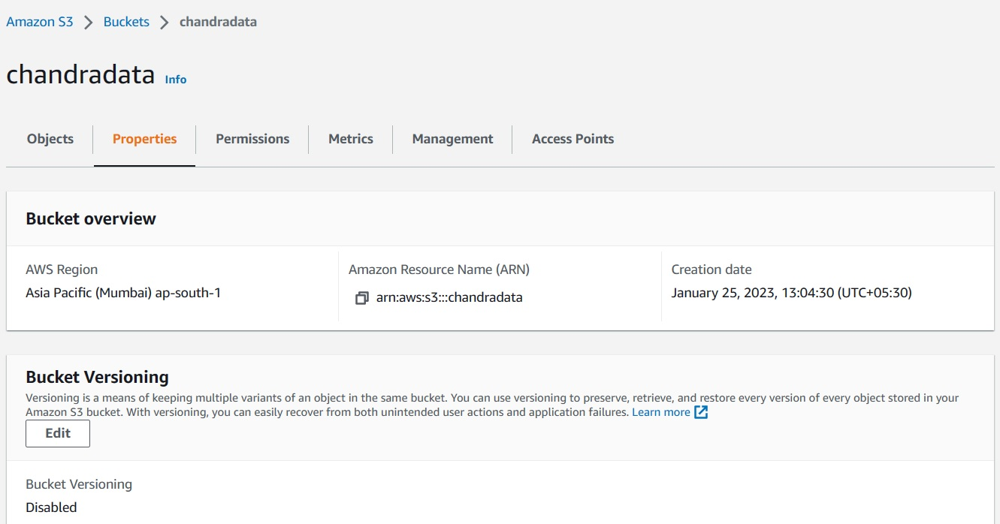
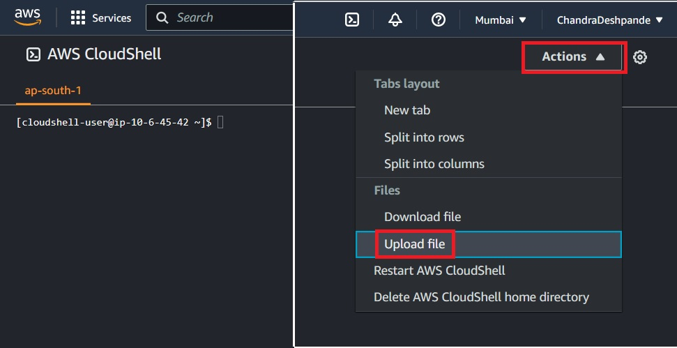
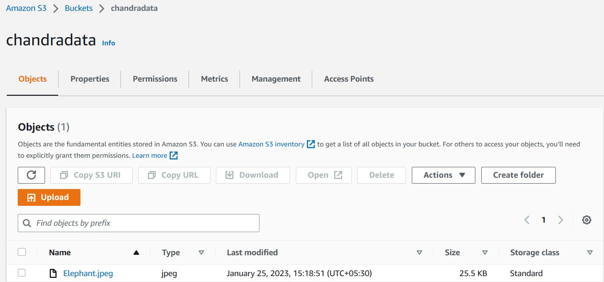
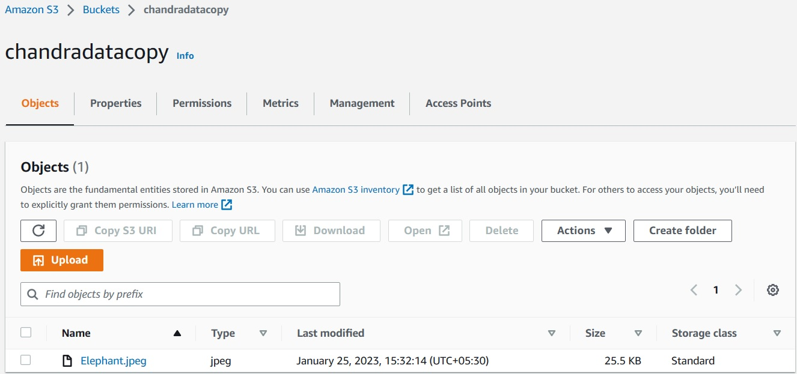
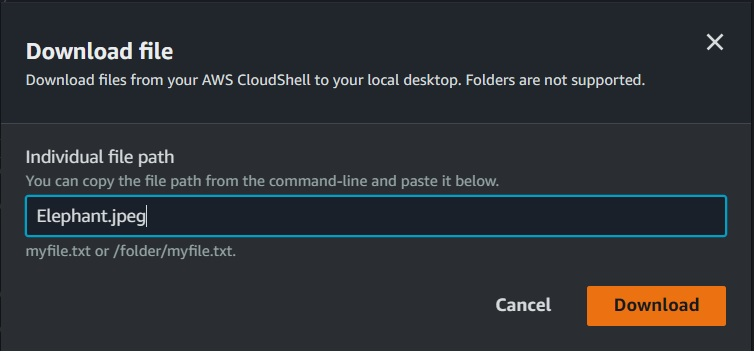

# AWS Simple Storage Service: Working with S3 through CLI
This lab covers following topics
* ### **Starting a cloud shell**
* ### **Creating bucket using CLI**
* ### **List buckets**
* ### **List objects from bucket recursively**
* ### **Uploading files**
* ### **Copy objects from a bucket to another**
* ### **Downloading objects from bucket**
* ### **Deleting object**
* ### **Deleting bucket**

### 1) Open Cloudshell
* #### Observe CloudShell Icon at the top ribbon
* #### Observe `Action` dropdown for Upload/Download files into and from Cloudshell Home Directory.
* #### Observe cloud shell prompt



### 2) Creating bucket and listing contents.
* #### Create a bucket: 
```bash
$ aws s3 mb s3://chandradata
```


* #### From bucket, list contents:
```bash
$ aws s3 ls s3://chandradata
```

* #### As bucket is empty, nothing is listed.

### 3) Uploading a file from local machine.
* #### First it is to be uploaded to AWS CloudShell Home directory.
* #### Browse to the file from local machine and upload.
* #### Note this step only uploads a file to Cloudshell Home directory.



* #### Copy command to copy from CloudShell home directory to bucket: 
```Bash
aws s3 cp Elephant.jpeg s3://chandradata
```
* #### List bucket to verify successful copy: 
```Bash
$ aws s3 ls s3://chandradata
```


### 4) Copy an Object from one bucket to another bucket.
* #### Create a new bucket: $ aws s3 mb s3://chandradatacopy
* #### List all buckets: aws s3 ls
* #### Copy a file from one bucket to another:
```bash
$ aws s3 cp s3://chandradata/Elephant.jpeg s3://chandradatacopy
```


### 5) Different list operations.
* #### List all buckets: 
```bash
$ aws s3 ls
```
* #### List a bucket: 
```bash
$ aws s3 ls se://chandradatacopy
```
* #### List a bucket recursively: 
```bash
$ aws s3 ls s3://chandradatacopy --recursive
```
* #### List a bucket and total size of it: 
```bash
aws s3 ls s3://chandradatacopy --recursive --human-readable --summarize
```

### 6) Download files from bucket to Cloudshell home.
* #### Copy file from bucket to Cloudshell Home
```bash
$ aws s3 cp s3://chandradatacopy/Elephant.jpeg
```
* #### Download file from CloudShell home to local machine.  Find the download option in `Actions' of CloudShell

* #### Observe, file is downloaded to local machine.

#### 7) Delete Resources
* #### If bucket is empty: 
```Bash
$ aws s3 rb s3://chandradatacopy
```
* #### If bucket is not empty: 
```Bash
$ aws s3 rb s3://chandradatacopy --force
```
### Thats all in this lab.


