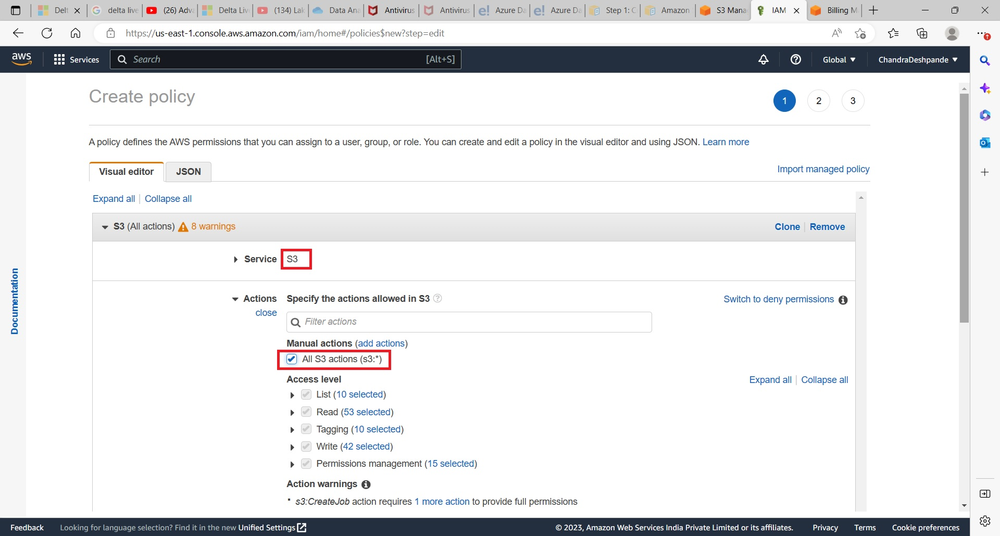

# AWS Simple Storage Service: Working with S3 using Python SDK
This lab covers following topics
<ol>
    <li>Create Access and Secret Access Keys for a file</li>
    <li> Understand SDK using Python040_S3010.ipynb</li>
</ol>

### 1) Create a bucket and upload a CSV file 'LoanData_Raw.csv'.
* #### Object Ownership: Keep it default as disabled.
* #### Block public access settings: Uncheck it.
* #### Bucket Versioning: Enable/Disable
* #### Encryption: Keep default
* #### Upload a CSV file LoadData_Raw.csv

    

### 2) Create Policy, User Group, User and Access Keys.
* #### Visit IAM from the AWS Services.
    

* #### Creating a Policy:
    

* #### Submitting actions:
    

* #### Setting Resource Privileges:
    

    

    

    

### 3) Create User Group.
* #### Creating a User Group:
    

* #### Alloting a policy to user group:
    

### 4) Create User and Access Key.
* #### Creating a User:
    

* ##### User Name: ChandraS3User
* ##### Enable Console Access: Check
* ##### Custom Password: Submit what you can remember.
* ##### User Must create a new password: Uncheck
    

* #### Create a User:
    

    

* #### Click on the user to observe following page:
    

* #### Go to Security Credential tab
* #### Scroll down to find button for 'Create Access Key'
    

* #### Set access key for application running outside AWS.
    

* #### Set description as for 'Python Code accessing S3'.
* #### Create access keys and copy from...
    

* #### Note:
* ##### Access key begins with words AKIA
* ##### Place access key for Client and Resource
* ##### Place Secret Access Key for Client and Resource.
* ##### Run the code.

    

