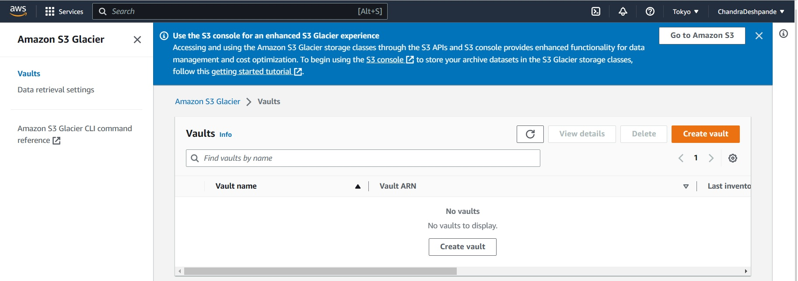
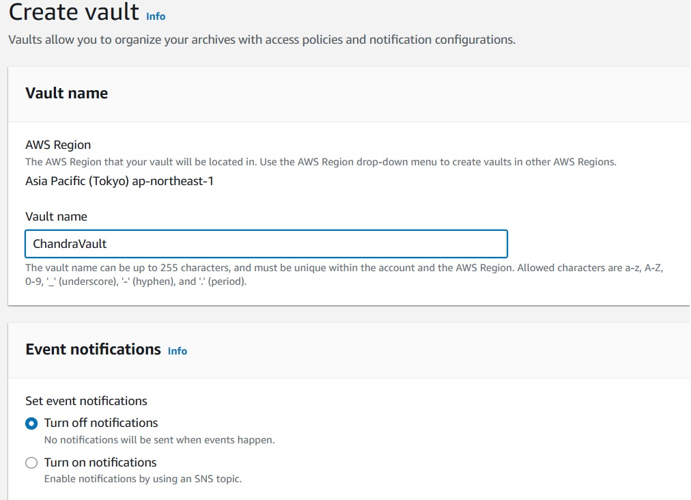
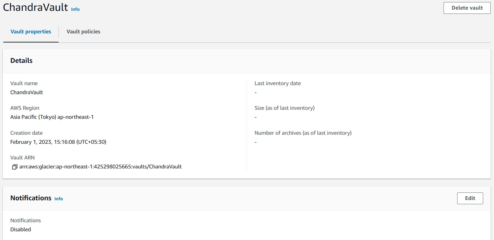

# AWS Simple Storage Service: Working with S3 Glacier
This lab covers following topics
<ol>
    <li>Create Access and Secret Access Keys for a file</li>
    <li> Understand SDK using Python040_S3010.ipynb</li>
</ol>

### 1) Open the Glacier Portal/Console.
* #### URL: https://console.aws.amazon.com/glacier/

    

* #### Create a vault: 
* ##### Asks for a region.
* ##### Asks for a vault name.
    

* ##### Observe properties of a vault.
    

